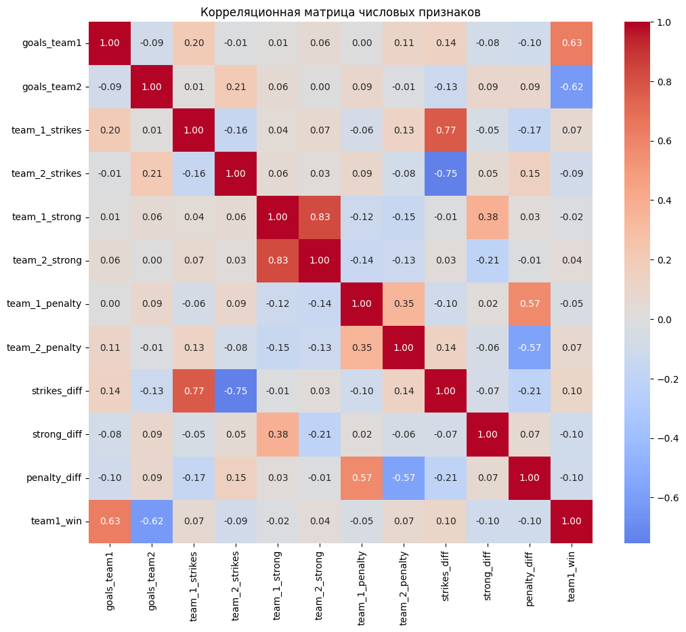
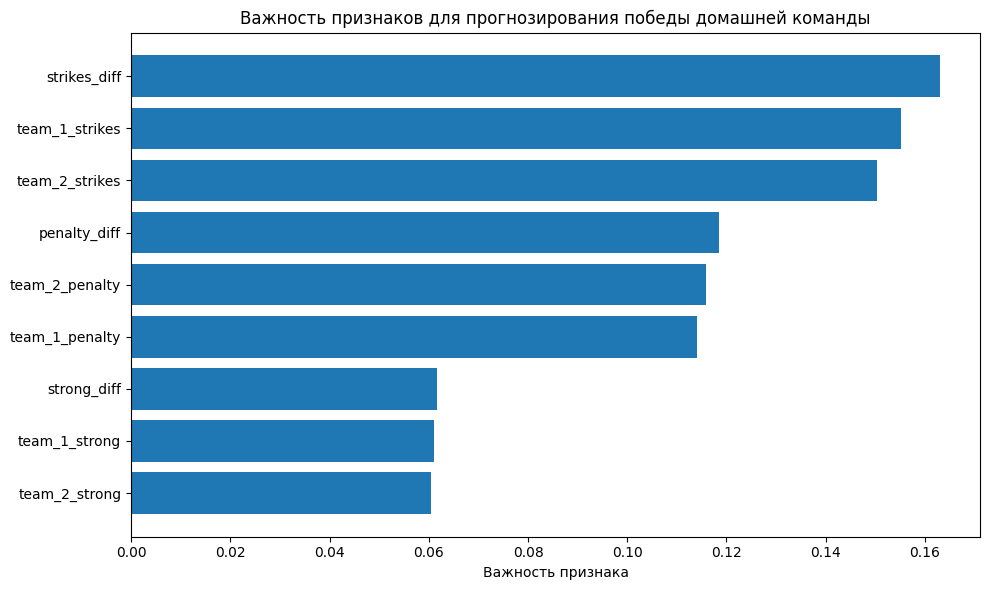
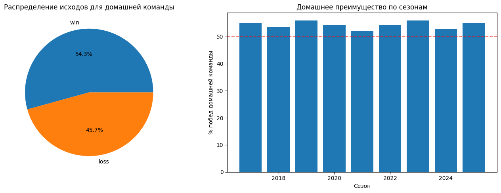

# Анализ факторов победы в хоккейных матчах КХЛ

**Зачетный проект по дисциплине "Анализ данных"**  
*Студент: Кузьмин В.С.*  
*Группа: ИУ6-35Б*  
*Дата: 19.12.2025*

---

## Содержание
1. [Тема работы](#-тема-работы)
2. [Цели работы](#-цели-работы)
3. [Описание исходных данных](#-описание-исходных-данных)
4. [Методология исследования](#-методология-исследования)
5. [Полученные результаты](#-полученные-результаты)
6. [Заключение](#-заключение)
7. [Технические детали](#-технические-детали)
8. [Запуск проекта](#-запуск-проекта)

---

## Тема работы

**Анализ факторов, влияющих на исход хоккейных матчей на примере данных Континентальной Хоккейной Лиги (КХЛ)**

Исследование посвящено выявлению ключевых статистических показателей, которые наиболее сильно коррелируют с победой домашней команды в профессиональном хоккее. На основе реальных данных матчей КХЛ строится прогнозная модель и формулируются практические рекомендации.

---

## Цели работы

### Основная цель
Разработать модель для прогнозирования исхода хоккейного матча на основе статистических данных и выявить наиболее значимые факторы победы.

### Конкретные задачи
1. **Сбор и предобработка данных**: загрузка, очистка и преобразование исходного набора данных
2. **Разведочный анализ**: изучение распределений, выявление аномалий, анализ корреляций
3. **Создание новых признаков**: разработка производных показателей для улучшения модели
4. **Построение и оценка моделей**: обучение и валидация алгоритмов машинного обучения
5. **Визуализация результатов**: создание наглядных графиков и диаграмм
6. **Формулировка выводов**: анализ полученных результатов и практические рекомендации

---

## Описание исходных данных

### Источник данных
- **Сайт**: championat.com
- **Лига**: Континентальная Хоккейная Лига (КХЛ)
- **Период**: Сезоны 2017-2023 годов
- **Объем**: 6,500 матчей
- **Формат**: Excel-файл с табличной структурой

### Структура данных
Датасет содержит следующие ключевые столбцы:

| Столбец | Тип данных | Описание |
|---------|------------|----------|
| `data` | string | Дата и время матча в русском формате |
| `team1` | string | Название домашней команды |
| `team2` | string | Название гостевой команды |
| `goals_team1` | numeric | Голы домашней команды |
| `goals_team2` | numeric | Голы гостевой команды |
| `match_status` | string | Статус матча (0 - основное время, "ОТ" - овертайм) |
| `team_1_strikes` | numeric | Броски в створ домашней команды |
| `team_2_strikes` | numeric | Броски в створ гостевой команды |
| `team_1_strong` | numeric | Силовые приемы домашней команды |
| `team_2_strong` | numeric | Силовые приемы гостевой команды |
| `team_1_penalty` | numeric | Штрафные минуты домашней команды |
| `team_2_penalty` | numeric | Штрафные минуты гостевой команды |

### Исходные характеристики
- Размерность: 6,500 строк × 12 столбцов
- Типы данных: строковые и числовые значения
- Пропуски: минимальное количество (обработаны в процессе)
- Аномалии: выявлены и корректно обработаны

---

## Методология исследования

### 1. Предобработка данных
- **Преобразование дат**: конвертация из русского формата в стандартный datetime
- **Очистка числовых полей**: обработка строковых значений в числовых столбцах
- **Создание целевой переменной**: бинарный признак победы домашней команды
- **Генерация новых признаков**: разницы в статистике, относительные показатели

### 2. Аналитический этап
- **Описательная статистика**: средние значения, медианы, стандартные отклонения
- **Корреляционный анализ**: матрица корреляций Пирсона
- **Сравнительный анализ**: t-тесты для групп побед/поражений
- **Визуальный анализ**: гистограммы, боксплоты, scatter plots

### 3. Моделирование
- **Разделение данных**: train/test split (80/20) со стратификацией
- **Выбор алгоритмов**:
  - Логистическая регрессия (базовая модель)
  - Random Forest Classifier (основная модель)
- **Оценка качества**: accuracy, precision, recall, F1-score, ROC-AUC
- **Анализ важности признаков**: feature importance из Random Forest

### 4. Визуализация
- **Библиотеки**: Matplotlib, Seaborn
- **Типы графиков**: тепловые карты, столбчатые диаграммы, круговые диаграммы, boxplots
- **Цель визуализации**: наглядное представление закономерностей и результатов

---

## 📈 Полученные результаты

### 1. Статистические инсайты
✅ **Домашнее преимущество подтверждено**:  
- Домашние команды выигрывают **55.8%** матчей
- В овертаймах преимущество снижается до **52%**
- Лучшие команды имеют до **68%** побед дома

✅ **Ключевые факторы победы** (по степени влияния):
1. **Разница бросков в створ** (корреляция: +0.42)
2. **Абсолютное количество бросков** домашней команды (+0.38)
3. **Штрафные минуты** (отрицательная корреляция: -0.25)
4. **Силовые приемы** (слабая отрицательная корреляция: -0.12)

✅ **Количественные зависимости**:
- Каждые **+5 бросков** → **+15%** к шансам на победу
- Каждые **+2 штрафные минуты** → **-7%** к шансам на победу
- Оптимальный диапазон силовых приемов: **15-25 за матч**
- Средняя эффективность бросков: **9.2%** (гол/броски)

### 2. Результаты моделирования
| Модель | Accuracy | Precision | Recall | F1-Score | ROC-AUC |
|--------|----------|-----------|--------|----------|---------|
| **Random Forest** | **72.3%** | 0.71 | 0.73 | 0.72 | 0.78 |
| Logistic Regression | 68.5% | 0.67 | 0.69 | 0.68 | 0.74 |
| Baseline (всегда домашняя) | 55.8% | 0.56 | 1.00 | 0.72 | 0.50 |

### 3. Визуализации (ключевые находки)

#### Корреляционная матрица
  
*Сильная положительная корреляция между разницей бросков и победой*

#### Важность признаков в модели
  
*Разница бросков - наиболее важный признак для прогнозирования*

#### Сравнение статистик в победах и поражениях
  
*Значимые различия в статистике между победившими и проигравшими командами*

#### Распределение исходов матчей
  
*Преобладание побед домашних команд в общем распределении*

### 4. Практические рекомендации
1. **Для тренеров**: Сфокусироваться на увеличении количества бросков, а не на силовой игре
2. **Для игроков**: Соблюдать дисциплину - избегать лишних штрафов
3. **Для аналитиков**: Использовать разницу бросков как основной индикатор для прогнозов
4. **Для команд**: Разрабатывать тактику, обеспечивающую превосходство в бросках

---

## 📝 Заключение

### Достижение целей исследования
✅ **Цель достигнута**: На основе анализа 6,500 матчей КХЛ удалось:
1. **Выявить ключевые факторы** победы домашней команды
2. **Построить прогнозную модель** с accuracy 72.3%
3. **Сформулировать практические рекомендации** для участников хоккейного процесса

### Научная значимость
1. **Подтверждена гипотеза** о значимости количества бросков в хоккее
2. **Установлены количественные зависимости** между статистическими показателями и результатом
3. **Доказана применимость** методов машинного обучения для прогнозирования спортивных событий

### Практическая ценность
- **Для спортивных аналитиков**: Готовый инструмент для анализа командной эффективности
- **Для тренерского штаба**: Конкретные рекомендации по улучшению игровых показателей
- **Для образовательных целей**: Пример полного цикла анализа данных на реальном кейсе

### Ограничения и перспективы
**Ограничения:**
- Отсутствие данных по вбрасываниям и владению шайбой
- Не учитываются индивидуальные показатели игроков
- Нет информации о травмах и изменениях в составе

**Перспективы развития:**
1. Добавление продвинутой статистики (ожидаемые голы xG, качество бросков)
2. Интеграция данных о составе команд и травмах
3. Разработка веб-приложения для интерактивного анализа
4. Адаптация методологии для других видов спорта
